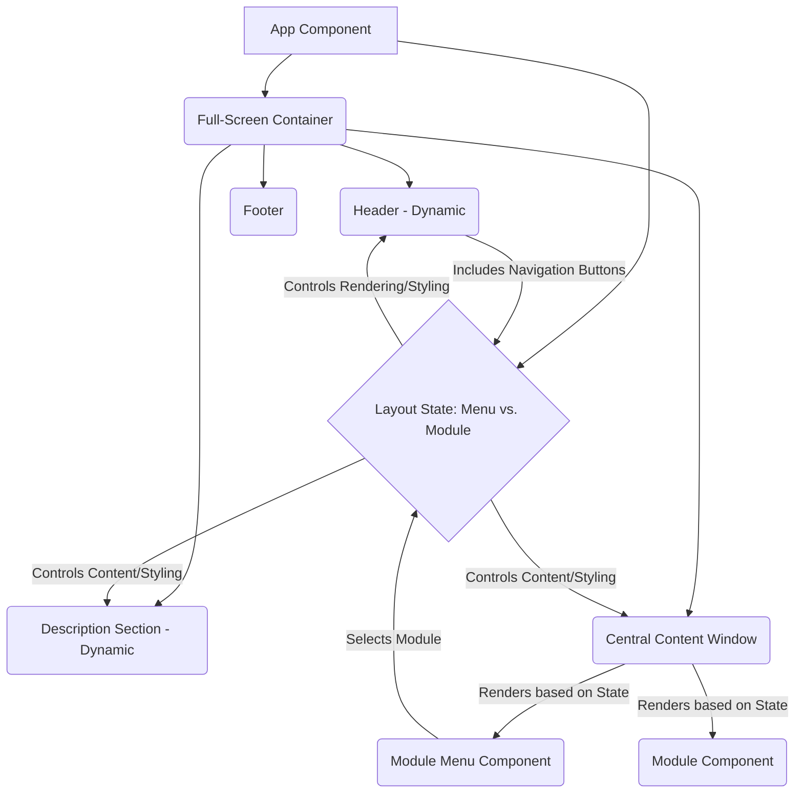

# Project Architecture

This document outlines the architectural design and principles for the Infotropy front-end project. The goal is to create a modular, scalable, and maintainable single-page application designed with future expansion by AI agents in mind.

## Core Principles

- **Modularity:** Components and features are designed as self-contained modules with clear interfaces.
- **Component-Based:** Utilizing React's component model for building the UI.
- **State-Driven Layout:** The application's visual state (e.g., displaying the menu or a specific module) is managed centrally and drives the rendering and styling of components across the full viewport.
- **Single Source of Truth:** Application state is centralized to avoid inconsistencies.
- **Convention over Configuration:** Establishing clear patterns for adding new modules and features.
- **Documentation:** Comprehensive markdown documentation is maintained to guide development (human and AI).

## High-Level Structure

The application follows a full-screen, non-scrolling layout with a dynamic central content area, a dynamic description section, and a dynamic header that transforms into a navigation bar.



- **`App` Component:** The root component. Manages the global application state, including the `activeModule` and potentially a `layoutState` (e.g., 'menu', 'module'). This state dictates which components are visible and their styling/positioning for animated transitions.
- **`Full-Screen Container`:** The main container element (e.g., the `<main>` tag) will be styled to occupy the full viewport height (`min-h-screen`, `h-screen`) and prevent overflow (`overflow-hidden`).
- **`Header` Component (Dynamic):** This component will render differently based on the `layoutState`. In the 'menu' state, it's a prominent title. In the 'module' state, it transforms into a compact navigation bar, potentially including the site title and navigation buttons. Animations will be applied to this transformation.
- **`Description Section` Component (Dynamic):** Displays textual content based on the `activeModule`. Positioned outside the central content window. Its content updates and may animate during layout transitions.
- **`Central Content Window` Component:** A container component that renders the active module or the module menu. Its size and position may change with animations during layout transitions.
- **`Footer` Component:** Displays copyright and general site information. Positioned outside the dynamic content area.
- **`Navigation Buttons` Component:** Contains buttons (e.g., "Back to Menu") that allow the user to change the `layoutState` and `activeModule` state in the `App` component, thereby switching the content displayed. These buttons will likely be integrated into the dynamic Header/Navigation Bar when a module is active.
- **`Module Menu Component`:** A specific component rendered in the `Central Content Window` when the `layoutState` is 'menu'. It lists available modules and allows users to select them, updating the `layoutState` and `activeModule`.
- **`Module Components`:** Individual components or sets of components representing simulations, features (like the AI chat), or other content. Each module component is self-contained and designed to be rendered within the `Central Content Window` when the `layoutState` is 'module'. They should accept necessary data (like their description) via props.
- **`State Management`:** Centralized in `App` to manage `activeModule` and `layoutState`.
- **`Animation Layer`:** Integration of an animation library (Framer Motion) to smoothly transition elements between layout states.

## Module Structure

Each module will reside in its own folder within the `src/modules/` directory.

```
src/
└── modules/
    └── [ModuleName]/
        ├── [ModuleName].js  # Main component file
        ├── components/      # Optional: Smaller components used within the module
        ├── utils/           # Optional: Module-specific utility functions
        └── styles/          # Optional: Module-specific Tailwind organization
```

Module-specific documentation will be located in `docs/modules/[ModuleName].md`.

## Technology Stack

- **Frontend Framework:** React (Functional Components, Hooks)
- **Styling:** Tailwind CSS (v3, exclusively for all styling)
- **Physics Engine:** Matter.js (for the initial simulation module)
- **AWS Interaction:** AWS SDK for JavaScript (for potential future client-side interactions with AWS services)
- **Build Tool:** Vite
- **Containerization (Optional Dev):** Docker
- **Animation Library:** Framer Motion

## Instructions for AI Agents

This project is specifically designed to be developed and maintained by AI agents. Adhering to the guidelines in [`docs/AGENT_GUIDELINES.md`](docs/AGENT_GUIDELINES.md) and the following instructions is critical for autonomous operation and context preservation:

1.  **Primary Knowledge Source:** The `docs` folder is the primary source of information. Consult relevant documentation files ([`docs/ARCHITECTURE.md`](docs/ARCHITECTURE.md), [`docs/STYLING.md`](docs/STYLING.md), [`docs/ANIMATION.md`](docs/ANIMATION.md), etc.) before starting work.
2.  **Task Management:** Refer to [`docs/todo.md`](docs/todo.md) for tasks and update upon verified completion.
3.  **Decision Logging:** Document significant decisions in `docs/decisions/`.
4.  **AWS Profile Usage:** Use the "personal" AWS profile for all AWS operations.
5.  **Utilize Available Tools:** Leverage provided tools effectively.
6.  **Code Quality:** Produce clean, readable, and well-commented code.
7.  **Styling:** Use Tailwind CSS classes exclusively. Refer to [`docs/STYLING.md`](docs/STYLING.md) for aesthetic guidelines.
8.  **Responsiveness:** Design components to be fully responsive.
9.  **Error Handling:** Include basic error handling.
10. **Animations:** Implement animated transitions using Framer Motion as described in [`docs/ANIMATION.md`](docs/ANIMATION.md).

## Aesthetic Guidelines (Terminal-like)

Refer to [`docs/STYLING.md`](docs/STYLING.md) for detailed guidelines on achieving the terminal-like aesthetic, including color palette, typography, spacing, and component appearance.

## Animation Strategy

Refer to [`docs/ANIMATION.md`](docs/ANIMATION.md) for the detailed animation strategy, including the use of Framer Motion and specific transition ideas (e.g., module opening animation, header transformation).

## Deployment Strategy (CI/CD)

Refer to [`docs/DEPLOYMENT.md`](docs/DEPLOYMENT.md) for the deployment plan, including the manual steps and the plan for implementing a CI/CD pipeline (e.g., GitHub Actions) for automated builds and deployments to S3 using the "personal" AWS profile.

## Documentation Structure

All project documentation is located in the `docs/` folder. Key documents include:

- [`docs/AGENT_GUIDELINES.md`](docs/AGENT_GUIDELINES.md): Universal guidelines for AI agents.
- [`docs/README.md`](docs/README.md): Project overview and setup.
- [`docs/ARCHITECTURE.md`](docs/ARCHITECTURE.md): Project architecture and design principles.
- [`docs/STYLING.md`](docs/STYLING.md): Aesthetic guidelines.
- [`docs/ANIMATION.md`](docs/ANIMATION.md): Animation strategy.
- [`docs/AWS_SETUP.md`](docs/AWS_SETUP.md): AWS infrastructure setup and profile usage.
- [`docs/DEPLOYMENT.md`](docs/DEPLOYMENT.md): Deployment process and CI/CD planning.
- [`docs/TESTING.md`](docs/TESTING.md): Testing strategy.
- [`docs/DOCKER.md`](docs/DOCKER.md): Docker setup.
- [`docs/todo.md`](docs/todo.md): Project task list.
- `docs/modules/`: Documentation for individual modules.

* `docs/decisions/`: Log of significant project decisions.
